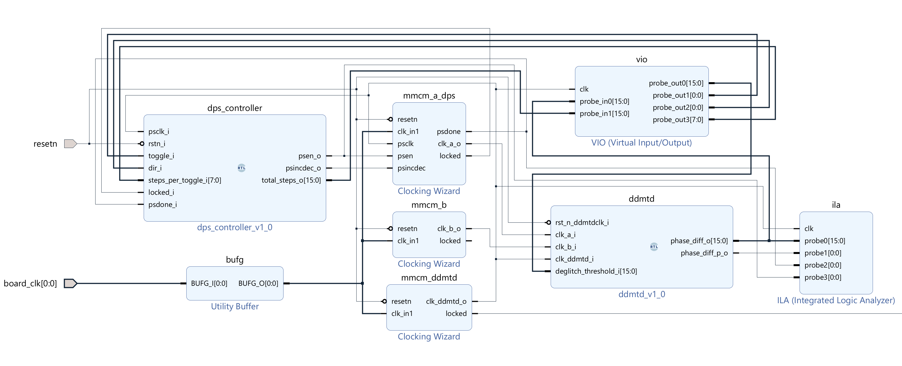

# FPGA-based Digital Dual Mixer Time Difference (DDMTD)

## 1. Overview

This project implements a **Digital Dual Mixer Time Difference (DDMTD)** phase measurement system using the native resources of a **Xilinx 7-series FPGA**.

The target application frequency is **125 MHz**, which corresponds to the standard Ethernet reference clock. The objective is to achieve **sub-nanosecond phase resolution** suitable for high-precision synchronization systems such as real-time Ethernet timing and digital PLL-based alignment.

A fully synthesizable HDL-based DDMTD core was designed and experimentally validated in hardware. Using MMCM-based clock generation and dynamic phase shifting within the FPGA fabric, the system demonstrates sub-nanosecond phase measurement capability at 125 MHz without any external analog circuitry.

All functionality is implemented exclusively with **7-series FPGA resources**, and the design was synthesized, implemented, and constrained for a **ZedBoard (Zynq-7000 SoC, 7-series architecture)** platform.

---

## 2. Implementation

### 2.1 DDMTD Core

The DDMTD module is implemented entirely in HDL and performs phase difference measurement between two 125 MHz clocks.

Key characteristics:

- Input clocks: `clk_a`, `clk_b` (125 MHz)
- Sampling clock: `clk_ddmtd` Generated by MMCM with slight frequency offset
- Modular phase difference computation
- Deglitch filtering
- Signed phase output
- One-cycle pulse indicating valid update

The sampling clock required for DDMTD operation is generated using the **MMCM (Mixed-Mode Clock Manager)** available in 7-series devices. No external clocking hardware is required.

The architecture follows the classical DDMTD principle:

$$
\Delta t = \frac{N}{f_{\text{sampled}}}
$$

where the phase difference is converted into a slow-beat frequency domain for high-resolution measurement.

---

### 2.2 Verification Environment

To validate linearity and effective resolution in hardware, an integrated verification environment was constructed using additional MMCM resources.

#### Dynamic Phase Shift (DPS)

An additional MMCM is configured to apply **Dynamic Phase Shift** to one of the input clocks.

- Phase step resolution: 17.86 ps (7-series MMCM characteristic)
- Controlled at runtime
- Deterministic phase increments

This enables controlled phase variation and direct comparison between applied shift and measured DDMTD output.

#### Runtime Control & Observation

- **VIO (Virtual Input/Output)**  
  - Phase step control  
  - Direction selection  
  - Reset control  
  - Parameter adjustment  

- **ILA (Integrated Logic Analyzer)**  
  - Real-time phase difference observation  
  - Internal signal monitoring  

This configuration enables closed-loop experimental validation entirely within the FPGA fabric.

---

## 3. Architecture

The overall system architecture is shown below.

  

### Block Description

- **BUFG**  
  Distributes the board reference clock.

- **MMCM_DDMTD**  
  Generates the slightly offset sampling clock required for DDMTD operation.

- **MMCM_A_DPS / MMCM_B**  
  Generates 125 MHz clocks.  
  One MMCM supports Dynamic Phase Shift for controlled phase injection.

- **DPS Controller**  
  HDL module controlling MMCM dynamic phase shift interface (PSEN, PSINCDEC, PSDONE).

- **DDMTD Core**  
  Measures modular phase difference between two clocks.

- **VIO**  
  Runtime parameter control.

- **ILA**  
  Internal signal capture and measurement verification.

The architecture enables fully self-contained phase measurement and validation without external test equipment.

---

## 4. Documentation

- 🔧 Source Build Guide: [srcs/README.md](srcs/README.md)
- 📊 Statistical Analysis: [stats/README.md](stats/README.md)

---

## 5. References

- P. Moreira, P. Alvarez, J. Serrano, I. Darwezeh and T. Wlostowski, "Digital dual mixer time difference for sub-nanosecond time synchronization in Ethernet," 2010 IEEE International Frequency Control Symposium, Newport Beach, CA, USA, 2010, pp. 449-453
- P. Moreira, P. Alvarez, J. Serrano and I. Darwazeh, "Sub-nanosecond digital phase shifter for clock synchronization applications," 2012 IEEE International Frequency Control Symposium Proceedings, Baltimore, MD, USA, 2012, pp. 1-6
- AMD Xilinx, “7 Series FPGAs Clocking Resources User Guide (UG472),” v1.14, 2018, https://docs.amd.com/v/u/en-US/ug472_7Series_Clocking
- AMD Xilinx, “Clocking Wizard LogiCORE IP Product Guide (PG065),” v6.0, 2022, https://docs.amd.com/r/en-US/pg065-clk-wiz
